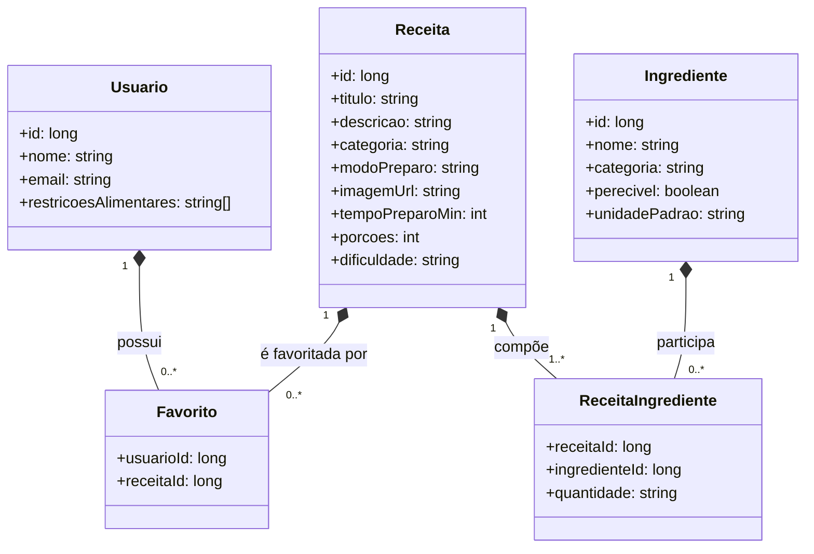

# cozinha-criativa-mackenzie
> **Cozinha Criativa** ajuda você a decidir o que cozinhar com os itens disponíveis em casa. Informe os ingredientes e receba sugestões de receitas que aproveitam ao máximo o que já está na despensa — promovendo praticidade, economia e criatividade na cozinha.

## Índice
- [Visão Geral](#visão-geral)
- [Objetivos](#objetivos)
- [Objetivos Funcionais](#objetivos-funcionais)
- [Objetivos Não-Funcionais](#objetivos-não-funcionais)
- [Interessados (Stakeholders)](#interessados-stakeholders)
- [Casos de Uso](#casos-de-uso)
- [Modelo de Domínio](#modelo-de-domínio)
- [Diagrama de Classes (Mermaid)](#diagrama-de-classes-mermaid)
- [Protótipo de Alta Fidelidade](#protótipo-de-alta-fidelidade)
- [Links do Projeto](#links-do-projeto)
- [Equipe](#equipe)
- [Próximos Passos](#próximos-passos)

---

## Visão Geral
O **Cozinha Criativa** oferece uma plataforma intuitiva onde o usuário informa os ingredientes que possui e recebe sugestões de receitas compatíveis. A iniciativa busca **reduzir desperdício**, **economizar tempo e dinheiro** e **estimular a criatividade** ao explorar novas combinações de pratos.

---

## Objetivos

### Objetivos Funcionais
- **Sugestões personalizadas de receitas:** o usuário informa ingredientes e obtém opções compatíveis.
- **Exploração livre de receitas:** navegar por categorias e preferências sem precisar informar ingredientes.
- **Interface simples e intuitiva:** experiência acessível e fácil de compreender.

### Objetivos Não-Funcionais
- **Desempenho:** sistema rápido e responsivo.  
- **Usabilidade:** interface agradável e fácil de navegar.  
- **Segurança:** proteção dos dados do usuário.  
- **Escalabilidade:** suporta crescimento de usuários mantendo estabilidade.

---

## Interessados (Stakeholders)
- **Usuários finais:** pessoas que usam a plataforma para encontrar receitas a partir do que já têm.
- **Equipe de desenvolvimento:** implementação, manutenção e evolução do sistema.
- **Mentores e professores:** acompanhamento e garantia dos requisitos técnicos da disciplina.
- **Administradores do sistema:** segurança, desempenho e disponibilidade da aplicação.

---

## Casos de Uso
**CU1 — Buscar Receitas Personalizadas**  
**Ator:** Usuário final.  
**Descrição:** Usuário informa ingredientes e recebe lista de receitas compatíveis.  
**Fluxo resumido:** (1) acessar busca → (2) informar ingredientes → (3) receber sugestões → (4) visualizar receita.

**CU2 — Explorar Receitas**  
**Ator:** Usuário final.  
**Descrição:** Navegar por categorias e tipos de pratos sem informar ingredientes.  
**Fluxo resumido:** (1) acessar exploração → (2) ver categorias/opções → (3) selecionar receita → (4) ver detalhes.

**CU3 — Gerenciar Preferências**  
**Ator:** Usuário final.  
**Descrição:** Definir/atualizar preferências (restrições alimentares, favoritos etc.).  
**Fluxo resumido:** (1) acessar configurações → (2) ajustar preferências → (3) salvar → (4) confirmações e recomendações mais aderentes.

---

## Modelo de Domínio

### Diagrama de Classes (Mermaid)
> _Cole este trecho em Markdown compatível com Mermaid (GitLab, Notion, Obsidian com plugin, etc.)_

---

## Protótipo de Alta Fidelidade
Telas de referência do protótipo:
- **Tela de Login — Cozinha Criativa**
- **Tela Inicial — Cozinha Criativa**
- **Tela Receita — Cozinha Criativa**
- **Tela Ingredientes — Cozinha Criativa**

> **Figma:** https://www.figma.com/make/Dowkna04dXT1mRPdG3opLX/Recipe-App?fullscreen=1

---

## Links do Projeto
- **Repositório:** https://github.com/PRAT-PROF-EM-ANALISE-E-DESEN-SISTEMAS/cozinha-criativa-mackenzie  
- **Trello (Kanban da disciplina):** https://trello.com/b/gvBan7Dz/kanban-mackenzie-prat-prof-em-analisedesen-sistemas-projeto-da-disciplina-10

---

## Equipe
- **Andreia do Nascimento Oliveira** — RA: 10424500  
- **Caio Bello Zamana** — RA: 10424594  
- **Henrique Ribeiro Ciriaco Silva** — RA: 10423915  
- **Verônica Lima de Faria** — RA: 10424236  
- **Zenaide Silva Souto** — RA: 10424121  

> **Instituição:** Universidade Presbiteriana Mackenzie  
> **Componente Curricular:** Prática Profissional em Análise e Desenvolvimento de Sistemas

---

## Próximos Passos
- Integração de **lista de compras** a partir das receitas escolhidas.  
- Recomendações **ainda mais personalizadas** (com base em histórico/preferências).  
- **Suporte multilíngue**.  
- **Aprimoramentos de infraestrutura** contínuos para desempenho e escalabilidade.

---